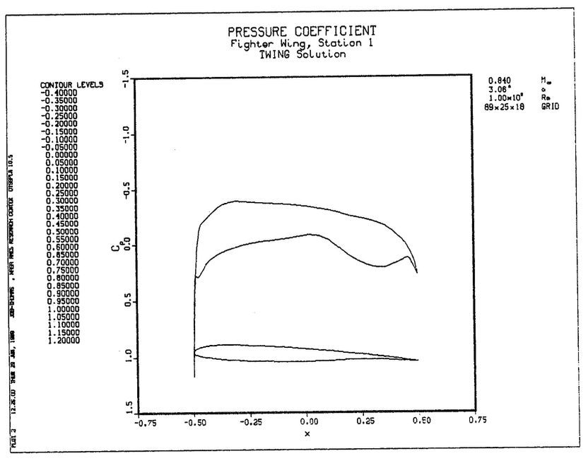

# PLOT3D Command Reference

This document describes the commands available in PLOT3D command files. This is the "legacy" mode and provides a way to create consistent visualizations from the command file.

## Table of Contents

- [CLEAR](#clear) - Clear computed arrays
- [CONTOURS](#contours) - Select contour levels
- [EXIT](#exit) - Exit PLOT3D
- [FSURFACE](#fsurface) - Function surface properties
- [FUNCTION](#function) - Select function to plot
- [HELP](#help) - Display help information
- [LIST](#list) - List data
- [MAP](#map) - Display work array map
- [MINMAX](#minmax) - Set plot ranges
- [PLOT](#plot) - Initiate a plot
- [QUIT](#quit) - Exit PLOT3D
- [RAKES](#rakes) - Particle trace configuration
- [READ](#read) - Read input files
- [SHOW](#show) - Show command status
- [SUBSETS](#subsets) - Select grid subsets
- [TEXT](#text) - Add plot text
- [VECTORS](#vectors) - Vector plot settings
- [VIEW](#view) - Set view axes
- [VPOINT](#vpoint) - Set viewpoint
- [WALLS](#walls) - Configure grid walls

---

## CLEAR

**Format:**
```
CLEAR
```

**Description:**

Clears all internally computed arrays (such as functions) from the WORK storage area. In general, this is handled automatically.

## CONTOURS

**Format:**
```
CONTOURS [max number of levels]
CONTOURS/INCREMENT [contour increment]
CONTOURS/MANUAL [start[,end,increment]]
```

**Description:**

Select contour levels or ranges.

**Qualifiers:**

- `/RANGE` - Show the range (minimum and maximum) of the current function over all active points in all active grids.

- `/AUTOMATIC` / `/INCREMENT` / `/MANUAL` - For the default AUTOMATIC mode, a maximum number of contour levels to be calculated is specified. In INCREMENT mode, a contour level increment is specified. The number of levels will depend on the function range. MANUAL entry of contour levels allows start-end-increment sets to be given.

- `/ATTRIBUTES` / `/NOATTRIBUTES` - Controls whether attributes such as color range, line type and thickness, and surface transparency are prompted for. (Symbols do not appear for PLOT/2D/LABELS using DISSPLA).

## EXIT

**Format:**
```
EXIT
```

**Description:**

Exit out of PLOT3D. Same as QUIT.

**Qualifiers:**

- `/SAVE` - Save the journal file. Default is to delete it.

## FSURFACE

**Format:**
```
FSURFACE
```

**Description:**

Set the following properties of function surface (or line) plots:

1. the scale factor of the function axis;
2. the origin (or offset) of walls drawn on the plot for reference; and
3. whether a 3D function surface will be drawn as grid lines or contour lines, if the contour attribute type in LINES.

**NOTE (Bounded-MVP):**
The current implementation supports specification of an iso-level threshold and scalar field selection. Legacy axis-property qualifiers (`/SCALE_FACTOR`, `/WALLS_ORIGIN`, `/CONTOUR`, `/GRID`) are parsed for compatibility and generate diagnostics but do not affect behavior.

Other properties of a function surface plot are set by other commands:

1. the VIEW command sets which spatial (x,y,z) axes will be plotted vs. the function;
2. the CONTOUR command controls whether the function surface will be plotted as lines or a surface (using polygons), as well as the color map and line or surface attributes to be used;
3. the MINMAX command sets the range of the function to be plotted (XMIN,XMAX,YMIX,YMAX, or ZMIN,ZMAX), depending upon which axis will be used for the function; and
4. the /SURFACE qualifier on the PLOT command is used to select a function surface plot instead of the (default) /CONTOUR plot.

In 3D, a function surface is a plot of two spatial dimensions (x,y,or z) vs. a scalar function. This is also known as a carpet plot. Which two spatial dimensions are used is chosen using the VIEW command. A right-handed coordinate system is maintained; thus a plot with VIEW XZ would plot x vs f vs z and the axis range for f would be controlled by YMIN and YMAX entered in the MINMAX command.

In 2D, a function surface can degenerate to a simple line plot, depending on the subset(s) active. A good example of a line plot is Cp (pressure coefficient) vs x for an airfoil. Here the appropriate subset would be just the points on the airfoil surface. In any case, the plot is of one spatial dimension and the function value. (The spatial dimension used is the first axis given to the VIEW command. Currently this spatial dimension will be always be plotted on the horizontal axis, and the function along the vertical axis.)

**Qualifiers:**

- `/SCALE_FACTOR=scale` / `/SCALE_FACTOR=AUTO` (D) - Allows entry of the relative scaling of the function axis compared to the spatial (x,y,or z) axes. Thus a scale factor of 2 would mean that 1 unit of the scalar function will have the same length as 2 units in x,y,or z. Specifying "AUTO" for the scale factor means that the length of the function axis (from MINMAX) will be made equal to the longer of the other two axes (3D), or equal to the other axis (2D).

- `/WALLS_ORIGIN=origin` / `/WALLS_ORIGIN=AUTO` (D) - Allows specification of the origin along the function axis for the walls which are drawn on the function surface or line plot. For example, if a value of 5 was entered for a plot of x vs y vs f, a wall at coordinates (x,y,5) would be plotted at (x,y,5) in (x,y,f) space. Specifying "AUTO" means that the origin will be set to zero.

- `/CONTOUR` / `/GRID` (D) - Controls whether a function surface will be drawn as grid lines or contour lines if the contour attribute type is LINES. This flag is ignored for 2D plots.

## FUNCTION

**Format:**
```
FUNCTION [function number]
```

**Description:**

Allows the selection of the function number to be plotted. Numbers between 0 and 99 are for grid-type information, between 100 and 199 are scalar functions (suitable for contour plots), and numbers between 200 and 299 are vector fields. Note that currently 200-299 refer to vector plots, while 300-399 generate particle trace-type plots. Functions from 400 on up are special functions (such as shock wave locations).

### Grid Functions

| Number | Description |
|--------|-------------|
| 0 | Walls alone (geometry) |
| 1 | Grids |
| 2 | Outline of IBLANK holes |
| 10 | 2D crossing grid check |
| 11 | Tetrahedron decomposition cell volume check |
| 12 | Tetrahedron decomposition grid crossing check |

### Scalar Functions

| Number | Description |
|--------|-------------|
| 100 | Density (or Q1) |
| 101 | Normalized density |
| 102 | Stagnation density |
| 103 | Normalized stagnation density |
| 104 | Log of normalized density |
| 110 | Pressure |
| 111 | Normalized pressure |
| 112 | Stagnation pressure |
| 113 | Normalized stagnation pressure |
| 114 | Pressure coefficient |
| 115 | Stagnation pressure coefficient |
| 116 | Pitot pressure |
| 117 | Pitot pressure ratio |
| 118 | Dynamic pressure |
| 119 | Log of normalized pressure |
| 120 | Temperature |
| 121 | Normalized temperature |
| 122 | Stagnation temperature |
| 123 | Normalized stagnation temperature |
| 124 | Log of normalized temperature |
| 130 | Enthalpy |
| 131 | Normalized enthalpy |
| 132 | Stagnation enthalpy |
| 133 | Normalized stagnation enthalpy |
| 140 | (Internal) energy |
| 141 | Normalized (internal) energy |
| 142 | Stagnation energy |
| 143 | Normalized stagnation energy |
| 144 | Kinetic energy |
| 145 | Normalized kinetic energy |
| 150 | u velocity |
| 151 | v velocity |
| 152 | w velocity |
| 153 | Velocity magnitude |
| 154 | Mach number |
| 155 | Speed of sound |
| 156 | Cross-flow velocity |
| 157 | Normalized 2D stream function |
| 158 | Divergence of velocity |
| 160 | x-momentum (Q2) |
| 161 | y-momentum (Q3) |
| 162 | z-momentum (Q4) |
| 163 | Stagnation energy per unit volume (Q5) |
| 170 | Entropy |
| 171 | Entropy measure s1 |
| 180 | x-component of vorticity |
| 181 | y-component of vorticity |
| 182 | z-component of vorticity |
| 183 | Vorticity magnitude |
| 184 | Swirl |
| 185 | Velocity x vorticity magnitude |
| 186 | Helicity density (degree of knottedness of tangled vortex) |
| 187 | Relative helicity |
| 188 | Filtered relative helicity |
| 190 | Shock function based on pressure gradient |
| 191 | Filtered shock function |
| 192 | Pressure gradient magnitude |
| 193 | Density gradient magnitude |

### Vector Functions

| Number | Description |
|--------|-------------|
| 200 | Velocity |
| 201 | Vorticity |
| 202 | Momentum (Q2,Q3,Q4) |
| 203 | Perturbation velocity |
| 204 | Velocity x vorticity |
| 210 | Pressure gradient |
| 211 | Density gradient |

### Particle Trace Functions

| Number | Description |
|--------|-------------|
| 300 | Particle traces |
| 301 | Vortex lines |

**Implementation Details:**

Particle traces are generated using:
- Trilinear interpolation of values of the vector function inside a computational cell
- Second-order Runge-Kutta steps to advance the particle in space

The particles are advanced using the velocity (or vector function) in real-space, but the step is limited so the particle will only advance some fraction of a computational cell.

Currently, five steps are taken per computational cell.

> See the RAKE command for specification of starting points and attributes for the traces.

### Shock Waves

| Number | Description |
|--------|-------------|
| 400 | Shock locations based on pressure gradient |
| 401 | Filtered shock locations |

**Algorithm:**

The current algorithm for "finding shocks" is to look at the Mach number component in the direction of the local pressure gradient. Where this value goes through one, AND the Mach number is decreasing, is plotted as a shock. See "Function Function_definitions Shock_function" for additional information. The way that the shock structure is plotted is determined by the FIRST contour specification (attributes, not level). Thus one can specify LINES (and therefor plane orientations) or SURFACES, color line thickness, surface transparency, etc.

### Non-dimensionalizations

Certain reference conditions are assumed in calculating some functions (the pressure coefficient, for example). These conditions are set in subroutines `SCAFUN` and `VECFUN`.

1. rho_inf = 1 (freestream density)
2. c_inf = 1 (freestream speed of sound)
3. p_inf = 1/gamma (freestream pressure)
4. |V|_inf = M_inf*c_inf (freestream velocity magnitude)

> Note: Conditions 3 and 4 follow from 1 and 2

### Fluid Constants

The fluid is assumed to be air. The perfect gas law is also used. The following constants are used in computing functions, and are defined in `BLOCK DATA BFLUID`.

- gamma = 1.4 (ratio of specific heats)
- R = 1 (gas constant)

> **TODO:** List equations for the various functions

## HELP

**Format:**
```
HELP [keyword [keyword [keyword ...]]]
```

**Description:**

The HELP command prints information on a list of keywords. `*` is a wildcard, while `*...` matches anything at the current level or below. Thus `HELP *...` prints all HELP information available. When responding to a "Topic?" or "Subtopic?" prompt, a `?` causes information for the current level to be repeated; a `<RETURN>` pops HELP up one level, and an end-of-file terminates the HELP session.

## LIST

**Format:**
```
LIST [XYZ or Q or FUNCTION]
```

**Description:**

List the XYZ, Q, or current function data. Output can be directed to the screen (default) or to a file. FORMATTED, UNFORMATTED, or BINARY files suitable for reading into PLOT3D can be produced as well.

**Qualifiers:**

- `/TEXT` (D) / `/FORMATTED` / `/UNFORMATTED` / `/BINARY` - Select the type of LIST output desired. TEXT output includes column headings and is suitable for viewing on the screen or printing out. FORMATTED, UNFORMATTED, and BINARY options produce files which can be read into PLOT3D using the READ command.

- `/OUTPUT=file` - Redirect the list output to a file or device. A file name is required for FORMATTED, UNFORMATTED, or BINARY lists, and will be prompted for in case the /OUTPUT qualifier has not been included in the command line.

## MAP

**Format:**
```
MAP
```

**Description:**

Produce a map of WORK array usage, including grid number, variable names, and source file names.

## MINMAX

**Format:**
```
MINMAX [xmin,xmax,ymin,ymax[,zmin,zmax]]
MINMAX/INCREMENT [xmin,xmax,xinc,ymin,ymax,yinc[,zmin,zmax,zinc]]
```

**Description:**

Set the plot ranges, or general region of interest for the plot.

**Qualifiers:**

- `/X` (D) / `/NOX` - Controls X-axis limits
- `/Y` (D) / `/NOY` - Controls Y-axis limits  
- `/Z` (D) / `/NOZ` - Controls Z-axis limits

  Controls which set of axis limits are to be changed. To change only the y-axis limits, for instance type `MINMAX/Y ymin,ymax`.

- `/INCREMENT` - Allows the specification of a tick mark increment. An increment of zero implies automatic scaling of tick marks and possibly rounding of axis limits. (Axis drawing can be suppressed by using PLOT/NOAXES.)

- `/XSCALE=scale` - Sets x-axis scale factor. Default is one.
- `/YSCALE=scale` - Sets y-axis scale factor. Default is one.
- `/ZSCALE=scale` - Sets z-axis scale factor. Default is one.

## PLOT

**Format:**
```
PLOT
```

**Description:**

Initiate a plot. When the plot is completed, type `<RETURN>` to return to PLOT3D command level.

**Qualifiers:**

- `/2D` / `/3D` (D) - Type of plot. Note that 2D data can be displayed in a 3D plot too.

- `/CONTOUR` (D) / `/SURFACE` / `/CARPET` / `/LINE` - If this is a plot of a scalar variable, set whether the plot will be a CONTOUR plot (the default) or a function SURFACE plot. A CARPET plot is another common term for a function surface, and in 2D a function surface degenerates to a LINE plot; thus CARPET and LINE are synonyms for SURFACE. See HELP FSURFACE for more information on function surface plots.

- `/AXES` (D) / `/NOAXES` - Controls whether axes are put on the plot or not.

- `/FIGURE=(areax,areay,charht)` / `/NOFIGURE` (D) - For /FIGURE, the plot size and character height is specified (in inches), title, contour bar, and additional text are not plotted, and other measures are taken to pretty up the plot.

- `/BACKGROUND=color` - Set the background color of the plot. Note that if "color" is of the form "RGB r,g,b", it must be enclosed in parentheses (e.g., `/BACKGROUND=(RGB .5,.5,.5)`) so the entire string is associated with the /BACKGROUND qualifier. The default is BLACK.

- `/UP=axis` - Specify which axis will be considered generally vertical for a plot. Valid "axes" are X, Y, Z, +X, +Y, +Z, -X, -Y, or -Z. (A right-handed system is always assumed.) A viewpoint specified in spherical coordinates (VPOINT/ANGLES) sets the angles phi, in the horizontal plane, and theta, above the plane. The default is `/UP=Z` for a 3D plot, `/UP=Y` for 2D.
  
  > **Note:** For a 2D plot, the "y-axis" really means the second axis on the plot: if VIEW XZ had been selected, /UP=Y would put the Z-valued axis up. Similarly, if VIEW ZX had been selected, /UP=Y would put the x-axis up! There is the possibility of confusion here!
  >
  > **Example:** We have a 2D airfoil, and would like velocity profiles with u horizontal and y vertical. We select proper subsets and function, type `VIEW YX` so the line plot will use Y as the spatial axis, `MINMAX 0 .2 -.5 1` so y will range from 0 to 0.2 u from -.5 to 1. Then we say `PLOT/2D/LINE/UP=X`: we're making a 2D line plot, and we want the axis which WOULD have been horizontal (and corresponds to the first set of MINMAX values) to be "up". Thus y will be up u horizontal.

- `/SCRIPT` - Further input will be interpreted as SCRIPT commands for controlling the orientation of the display on the screen. STOP will signify the end of SCRIPT commands. See SCRIPT for information on these commands.

### SCRIPT Commands

These commands, when entered following a `PLOT/SCRIPT` command, control the motion of the objects on the display screen.

#### CENTER

**Format:**
```
CENTER [x,y,z]
```

**Description:**

Move the center of the display (equivalent to the center of the MIN-MAX box) to the given (x,y,z) point. Objects on the screen will rotate about this point.

**Qualifiers:**
- `/FROM=(x,y,z)` - Specify what point to move the center from. Default is the previous CENTER, or center of the MINMAX box.
- `/IN=n` - Move the center to the new point in n frames.

#### GO

**Format:**
```
GO [number of frames]
```

**Description:**

`GO n` means advance the display n frames. The default value for n is 1.

#### HOLD

**Format:**
```
HOLD [number of frames]
```

**Description:**

`HOLD n` means hold the display still for n frames. Default value for n is 1.

#### INTERACTIVE

**Format:**
```
INTERACTIVE
```

**Description:**

Temporarily enable interactive manipulation of the display. Typing `<RETURN>` returns control to the SCRIPT input.

#### STOP

**Format:**
```
STOP
```

**Description:**

Signals the end of SCRIPT commands.

#### VPOINT

**Format:**
```
VPOINT [x,y,z]
VPOINT/ANGLES [phi,theta,radius]
```

**Description:**

Change the viewpoint to the given (x,y,z) or (phi,theta,radius) position. Viewpoint is always looking toward the CENTER point.

**Qualifiers:**
- `/ANGLES` - Viewpoint (as well as FROM viewpoint, if supplied) is in (phi,theta,radius) spherical coordinates. Default is (x,y,z) Cartesian coordinates.
- `/FROM=(x,y,z)` - Viewpoint from which to move. Specified as (x,y,z) or (phi,theta,radius), depending on /ANGLES. Default is to move from previous viewpoint.
- `/IN=n` - Move the viewpoint to the new viewpoint in n frames.


## QUIT

**Format:**
```
QUIT
```

**Description:**

Exit out of PLOT3D. Same as EXIT.

**Qualifiers:**

- `/SAVE` - Save the journal file. Default is to delete it.

## RAKES

**Format:**
```
RAKES
```

**Description:**

Specify the starting locations and attributes of particle traces (and vortex lines, both of which are traced through a vector field).

**Qualifiers:**

- `/IJK` (D) / `/XYZ` - Traces can be started at (i,j,k) grid points or at (x,y,z) physical coordinates.

- `/ADD` - Rake specifications are to be added to the end of existing rake specs. This does not work when the particle traces are read in with /READ=file.

- `/ATTRIBUTES` (D) / `/NOATTRIBUTES` - Controls whether attributes such as color, line type and thickness, and surface transparency are prompted for.

- `/READ=file` / `/WRITE=file` - Particle traces can be written out or read in to PLOT3D, allowing traces to be replotted later, or calculated elsewhere.

- `/+TIME` (D) / `/-TIME` / `/+-TIME` - Controls whether traces in this rake are followed in the plus, minus, or both directions of the vector field.

- `/MAXPOINTS=n` - Set the maximum number of points for each particle trace segment, allowing a crude control on the length of the trace. Each trace MIGHT be made up of more than one segment, as a new segment is started when a trace continues in another grid. Currently, a particle takes 5 steps to cross a computational cell; therefore, setting `/MAXPOINTS=15` means that each trace will be roughly 3 cells long. The default value (and maximum) is `/MAXPOINTS=2000`.

- `/SCALAR_FUNCTION=function number` / `/NOSCALAR_FUNCTION` (D) - Sets the function to be used to determine the color of the traces. Each trace will be colored according to the value of this function (which must be a scalar function) and the color map(s) specified using the CONTOUR command. If /NOSCALAR_FUNCTION is selected, the color attribute color will be used. This is the default.

**Restriction:**

Traces can be restricted to remain in computational planes. This is useful for plotting particle traces on symmetry planes or for simulating oil flow. For oil flow pictures, traces are often restricted to remain one computational plane above the surface (as the velocity on the surface is zero).

**File Format:**

Trace files are read and written using FORTRAN UNFORMATTED I/O as follows:

```fortran
   10 CONTINUE
      READ(unit,END=20) IRAKE, ITRACE, N, IGRID
      READ(unit) (X(I),I=1,N),(Y(I),I=1,N),(Z(I),I=1,N),(T(I),I=1,N),
     C           (RI(I),I=1,N),(RJ(I),I=1,N),(RK(I),I=1,N)
      GOTO 10
   20 CONTINUE
```

`IRAKE` is the rake number, and will be used to determine the attributes of the trace when it is drawn. `ITRACE` is the trace number inside this rake, and `N` is the number of points to be read in the following record. `IGRID` is the grid number for this part of the trace. The physical location (x,y,z) and time t is recorded for each point in the trace, as well as the (i,j,k) coordinates, saved as real numbers to indicate both the cell number and position within the cell of the point.

A trace may appear in the file as several segments, all with the same rake and trace number.

## READ

**Format:**
```
READ
```

**Description:**

Read input files.

**Qualifiers:**

- `/1D` / `/2D` / `/3D` (D) - Controls whether the input files are expected to be 1-, 2-, or 3-dimensional.

- `/XYZ=file` (D) - Input standard grid file.
- `/Q=file` (D) - Input standard Q file, including density, momentum, and stagnation energy per unit volume.
- `/FUNCTION=file` - Input an arbitrary function.
- `/MDATASET` - For multiple datasets in one file.
- `/MGRID` - If the files contain multiple grids, in the multiple-grid form.

- `/FORMATTED` / `/UNFORMATTED` (D) / `/BINARY` - Controls whether the files are expected to be in FORTRAN FORMATTED or UNFORMATTED form.

- `/PLANES` / `/WHOLE` (D) - Specifies whether the data is to read in planes (one plane per record) or the whole thing at once. Note that planes has no effect for reading other than 3D datasets.

- `/CHECK` (D) / `/NOCHECK` - Controls whether the default checking of Q data for zero or negative density or pressure is performed. Bypassing this check can speed up the Q file reading significantly.

- `/BLANK` / `/NOBLANK` (D) - Signals whether the XYZ file contains an integer array IBLANK as a fourth (or rather n-dimension plus one) variable. At (I,J,K) points where IBLANK=0, data will NEVER BE USED.


## SHOW

**Format:**
```
SHOW
```

**Description:**

Show the current status of some commands.

## SUBSETS

**Format:**
```
SUBSETS
```

**Description:**

Allows parts of grids to be selected as "active".

**Qualifiers:**

- `/GRID=grid number` - Specifies which grid these subsets are to be associated with (default is grid 1).

- `/ADD` - These subsets are to be added on to the current list, rather than starting from subset number 1.

- `/ATTRIBUTES` / `/NOATTRIBUTES` (D) - Controls whether attributes such as color, line type and thickness, and surface transparency are prompted for. Subset attributes are applied to GRID plots.

## TEXT

**Format:**
```
TEXT ["line1" ["line2"]]
```

**Description:**

Allows the entry of up to two additional lines of text (besides the title), to be centered above future plots. This text will continue to be used until another TEXT command is given. Current text can be "erased" by entering a `<RETURN>` in response to the prompt for text. (Text is prompted for if not entered on the command line.) If text is entered on the command line, be sure to enclose each line in double quotes.

## VECTORS

**Format:**
```
VECTORS
```

**Description:**

Sets vector plot characteristics, such as arrowheads, vector length, and associated scalar function for vector colors.

**Qualifiers:**

- `/SCALAR_FUNCTION=function number` / `/NOSCALAR_FUNCTION` (D) - Sets the function to be used to determine the color of the vectors. Each vector will be colored according to the value of this function (which must be a scalar function) and the color map(s) specified using the CONTOUR command. If /NOSCALAR_FUNCTION is selected, the color attribute color will be used. This is the default.

- `/ATTRIBUTES` (D) / `/NOATTRIBUTES` - Sets various vector attributes. NOATTRIBUTES resets everything to default values. Attributes are:
  - **Color** - Vector color if NOSCALAR_FUNCTION is selected. Default is white.
  - **Vector scaling** - Whether or not the vector is scaled with the magnitude. Default is scaled.
  - **Vector length scale factor** - Default is 1 (a vector function of unit length will be drawn as one unit long.)
  - **Arrowhead type** - LINES (D), FILLED, or NONE
  - **Arrowhead size factor** - Default value of 1 corresponds to 3/10th the vector length for scaled arrowheads, 1/50th the longest axis if not scaled.
  - **Line type**
  - **Line thickness**
  - **Symbol type** - Causes a symbol to be put at the base of the vector
  - **Symbol size**

> See HELP ATTRIBUTES for information on line type, etc.

## VIEW

**Format:**
```
VIEW [view]
```

**Description:**

The VIEW command is used for two cases:

1. To specify which axes are to be horizontal and vertical for a 2D plot, and
2. To specify which two spatial axes are to be used for 3D function surface (carpet) plots.

Choices are: XY, XZ, YZ, YX, ZX, ZY, TOP, SIDE, FRONT. TOP, SIDE, FRONT are equivalent to XY, XZ, YZ, respectively.


## VPOINT

**Format:**
```
VPOINT [x,y,z]
VPOINT/ANGLES [phi,theta,radius]
```

**Description:**

Enter a viewpoint for a 3D plot.

**Qualifiers:**

- `/XYZ` (D) / `/ANGLES` - Controls whether the viewpoint will be interpreted as an (x,y,z) point in space, or as phi,theta,radius values, corresponding to DISSPLA conventions.

## WALLS

**Format:**
```
WALLS
```

**Description:**

Specifies which parts of the grids should be drawn for all plots, indicating the grid "geometry" or "configuration" (hence the name WALLS).

**Qualifiers:**

- `/GRID=grid number` - Specifies which grid these walls are to be associated with (default is grid 1).

- `/ADD` - These walls are to be added on to the current list, rather than starting from wall number 1.

- `/ATTRIBUTES` (D) / `/NOATTRIBUTES` - Controls whether attributes such as color, line type and thickness, and surface transparency are prompted for.


## Example Command Files

### 2D Pressure Coefficient Using TWING (`PLOT/LINE`)



**File:** `cp.com`

```text
! cp.com reads files created by "top" which is a translator
! for twing output. The cp.com file just displays one cp
! curve over the root airfoil section of a fighter wing.
read /planes /xyz=ft01.bin /q=ft02.bin
function 114
fsurface /walls_origin=1
minmax /inc -0.75,0.75,0.25,1.5,-1.5,-0.5
view xz
text
Fighter Wing, Station 1
TWING Solution
wall
a

1

last


subset
a

1

last


plot/line/2d
```

### 3D Comparison of Computational and Experimental Data (Space Shuttle)

These are the command files for the picture in the first color plate, showing the comparison of computational and experimental data for the Space Shuttle.

Before these files were used, a simple program was written that combined the computational and experimental data into one multiple-grid data set. That is, the combined data set contained one group of grids for the experimental data, and another group of grids for the computational data.

There are three `.com` files involved: `top.com` (the top view of the shuttle) calls `surf.com` (the subsets for the surface) and `cons.com` (color contours). Together, these command files produce three plots, which are combined in GAS to produce the final image. Notice that the first command file (`top.com`) plots three times: the first plot shows the grid lines of all the subsets that are going to get color contours. The purpose of this wireframe model is to produce something simple to manipulate in GAS, to position the parts correctly. A color-contoured model would have been much too cumbersome to move around. The next plot shows the color contours, that is, the colors on the surface of the model, representing the various pressure coefficients on the surface. The third plot creates a thick white line to divide the halves of the final image; the white line is used as an overlay (foreground) in GAS.

The other two command files are called from within `top.com` using the `@` symbol.

These plots were prepared for GAS by running these command files through PLOT3X. Chapter 5 gives more information on GAS and PLOT3X. GAS is frequently used (on IRIS workstations) to combine objects created with PLOT3D and SURF, and to add titles. The titles on this image were added in GAS.

**File:** `top.com`

```text
re/mg/noc/x=surfx/q=surfq
min/inc -100 3000 100 -500 500 100 0 800 100
vp/a -90 90 3200
@surf
fu 1
p/full/noax
fu 114
@cons
p
wall/gr=5
a

2

1


wh

2


a

38

1


wh

2


wall/gr=7
a

2

1


wh

2


a

76

1


wh

2


fu 0
p
```

**File:** `surf.com`

```text
subs/gr=1
a

1 17

1


subs/gr=5
a

2 38

1


subs/gr=6
a

a

1


subs/gr=7
1 80

2 76

1

80 81

2 33

1

80 81

71 76

1


```

**File:** `cons.com`

```text
con/m
-1.10 -.55 .025
c
rgb .5 .5 .5 rgb .5 .5 .5 rgb .5 .5 .5 whi


-.55 .55 .025
c
whi blu cy gr ye re ma


.55 1.55 .025
c
ma whi whi whi whi whi whi


```


